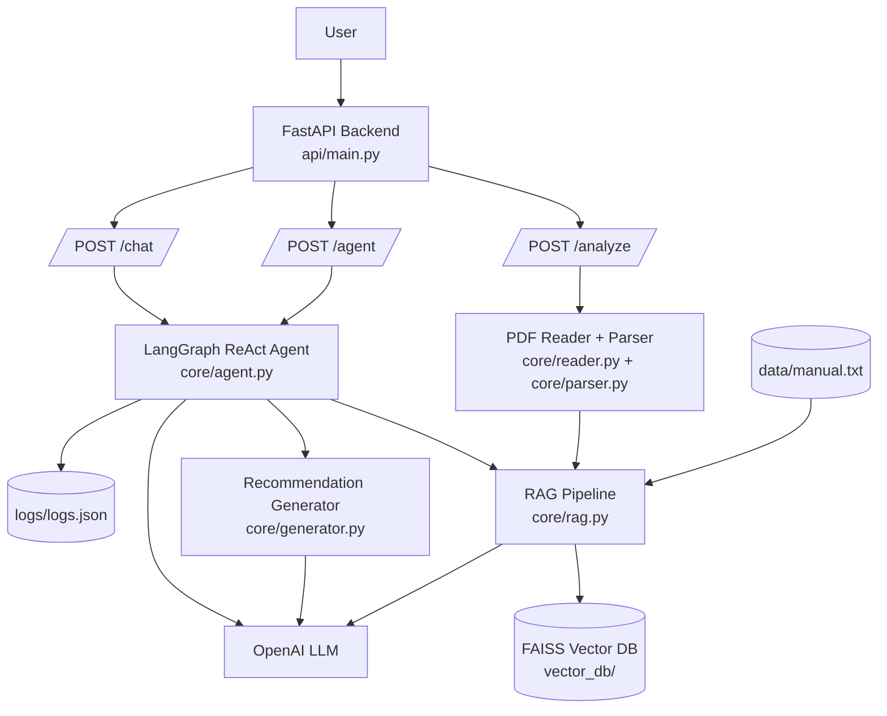

# Maintenance Recommendation Agent

This project is an AI-based maintenance recommendation system using:

* FastAPI (backend)
* LangGraph / LangChain agent
* OpenAI LLM
* RAG with FAISS
* PDF parsing

The system can:

* Upload maintenance report (PDF)
* Extract text
* Retrieve knowledge from manual
* Generate recommendation
* Chat with agent
* Use ReAct loop agent

---

# Architecture Diagram



---

# Project Structure

maintenance_agent/

core/
reader.py
parser.py
rag.py
generator.py
logger.py
agent.py

api/
main.py

data/
manual.txt

vector_db/

logs/

venv/

---

# Setup Python Environment

Go to project folder:

```bash
cd maintenance_agent
```

Create venv (if not created)

```bash
python -m venv venv
```

Activate venv (Mac / Linux)

```bash
source venv/bin/activate
```

Activate venv (Windows)

```bash
venv\Scripts\activate
```

You should see:

```
(venv)
```

---

# Install requirements

```bash
pip install -r requirements.txt
```

If no requirements.txt:

```bash
pip install fastapi uvicorn langchain langgraph langchain-openai langchain-community pdfplumber faiss-cpu python-dotenv
```

---

# Run FastAPI Server

From project root:

```bash
source venv/bin/activate
```

Run:

```bash
python -m uvicorn api.main:app --reload --port 8000
```

Swagger UI:

```
http://127.0.0.1:8000/docs
```

---

# API Endpoints

Analyze PDF

```
POST /analyze
```

Upload PDF file

Agent query

```
POST /agent
```

Body:

```
query: string
```

Chat (optional)

```
POST /chat
```

---

# Correct Order to Use API

1. Call /analyze
2. Upload PDF
3. Call /agent
4. Ask question

Agent uses last uploaded PDF.

---

# Notes

* Always activate venv before running backend
* Always run /analyze before /agent
* Vector DB stored in vector_db/
* Logs stored in logs/logs.json
* Agent uses manual + uploaded PDF

---

# Common Commands

Activate venv

```bash
source venv/bin/activate
```

Run API

```bash
python -m uvicorn api.main:app --reload
```

Stop server

```
CTRL + C
```

---

# Future Improvements

* Memory for agent
* Multi PDF support
* Better UI
* Auth
* Deployment
* Docker
